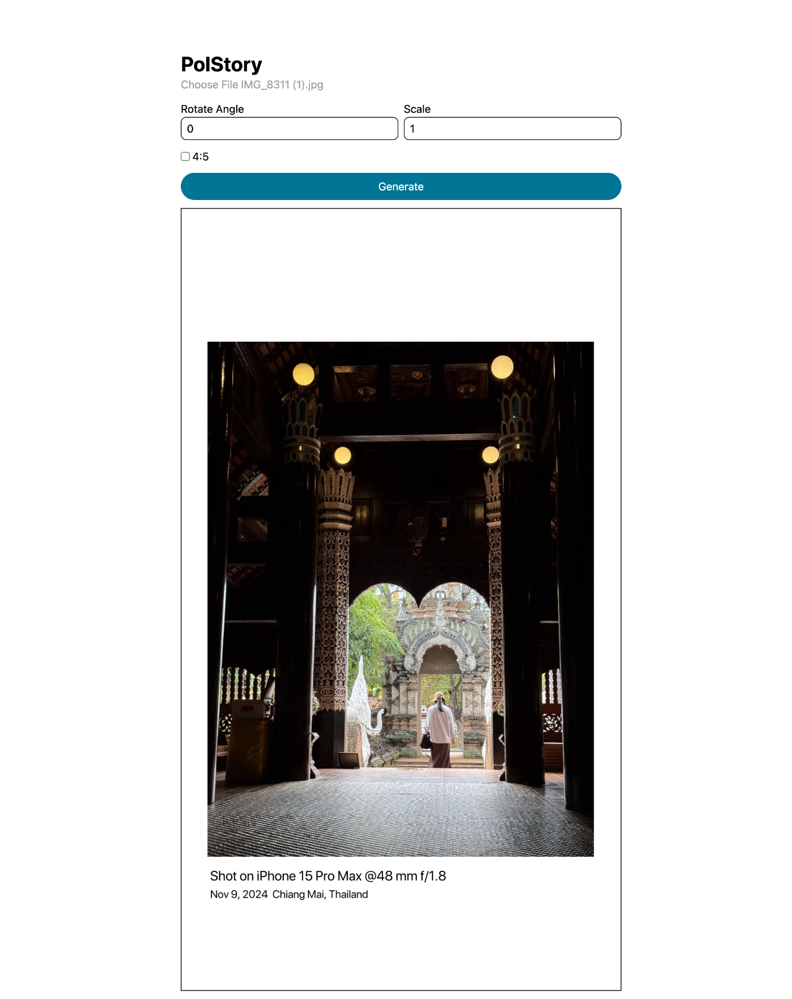

# Minimal Frame for Instagram

This project provides a minimalist framework to create framed pictures optimized for Instagram posts. The solution uses Go for backend processing and a modern frontend built with React (using Vite) to deliver a responsive and intuitive user interface.

## Features

- **Minimalistic Design:** Clean, simple layout focused on Instagram aesthetics.
- **Frame Generation:** Generates custom frames for pictures tailored for Instagram posts.
- **Integrated Frontend & Backend:** Leverages Go for core processing and a React frontend for previewing and managing frames.

## Project Structure

- **main.go:** Entry point for the Go backend.
- **route/**: Contains route definitions and additional backend logic.
  - *generate916.go, generate45.go, MetadataType.go*: Code handling frame generation and metadata.
- **frontend/**: Contains the React frontend application.
  - *index.html*: Main HTML file.
  - *src/*: React components, styles, and utilities.
  - *package.json & vite.config.ts*: Configuration for frontend development.

## Setup and Installation

1. **Clone the Repository:**

   ```bash
   git clone <repository-url>
   cd polstory-go
   ```

2. **Backend Setup:**

   Ensure you have Go installed. Then build or run the backend:

   ```bash
   go run main.go
   ```

3. **Frontend Setup:**

   Navigate to the `frontend` directory and install dependencies:

   ```bash
   cd frontend
   pnpm install
   pnpm run dev
   ```

4. **View the Application:**

   [http://localhost:5173](http://localhost:5173) to view frontend.

   [http://localhost:3000](http://localhost:3000) to view backend.

## Usage

- Use the provided Go routes to generate minimal frames for your pictures.
- Customize fonts and styles by modifying the assets in the `fonts/` and `frontend/src/` directories.
- Integrate further processing or editing functionalities as needed.

## Contributing

Feel free to fork the repository and submit pull requests. For major changes, please open an issue first to discuss what you would like to change.

## License

This project is provided under the MIT License.

## Image Preview

```